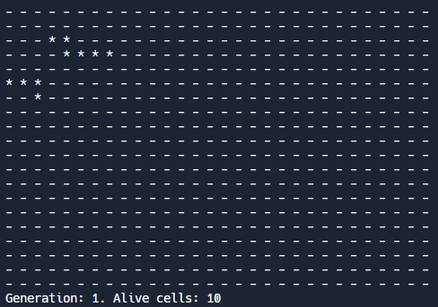
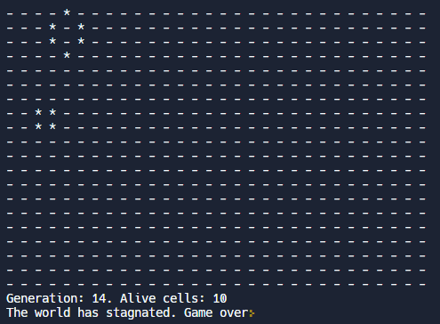
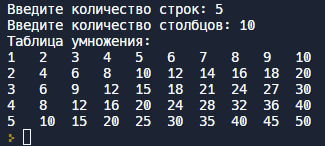
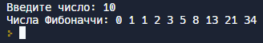

# **Портфолио**

## Гюлумян Артём Юрьевич

 

> _Всем привет! Меня зовут Артём. Я прохожу обучение в Нетологии по программе **Разработчик на С++**. Интересуюсь миром IT с 2006 года и вот сейчас активно начал погружаться в эту сферу, изучая программирование. Опыта пока не много, но я с радостью поделюсь своими маленькими достижениями._

 

# Игра "Жизнь"

## Описание

Место действия игры — Вселенная. Это размеченная на клетки ограниченная плоскость.

Каждая клетка на этой плоскости может находиться в двух состояниях: быть «живой», то есть заполненной, или быть «мёртвой», то есть пустой. Клетка имеет восемь соседей, окружающих её.

Распределение живых клеток в начале игры называется первым поколением. Каждое следующее поколение рассчитывается на основе предыдущего по правилам:

1. В пустой (мёртвой) клетке, рядом с которой ровно три живых клетки, зарождается жизнь.
2. Если у живой клетки есть две или три живых соседки, то эта клетка продолжает жить. В противном случае, если соседей меньше двух или больше трёх, клетка умирает «от одиночества» или «от перенаселённости».

Игра прекращается, если:

- на поле не останется ни одной «живой» клетки;
- при очередном шаге ни одна из клеток не меняет своего состояния, то есть складывается стабильная конфигурация.

Игрок не принимает прямого участия в игре, а только расставляет начальную конфигурацию «живых» клеток, которые затем взаимодействуют согласно правилам уже без его участия. Он является наблюдателем.

Реализовано на С++.

## Скриншоты

 

## Ссылка

Попробовать программу в действии, а также ознакомиться с её кодом можно по [ссылке](https://replit.com/@Timon9393/Coursework-1-Game-Life).

 

# Таблица умножения

## Описание

Программа предлагает пользователю ввести количество строк и столбцов, после чего генерирует таблицу умножения с указанными пользователем параметрами. Реализовано на С++.

## Скриншоты

## Ссылка
Попробовать программу в действии, а также ознакомиться с её кодом можно по [ссылке](https://replit.com/@Timon9393/homework-103).

 

# Числа Фибоначчи

## Описание

Программа предлагает пользователю ввести произвольное число, после чего выводит на экран последовательность чисел Фибоначчи в количестве, равном введённому пользователем числу. Особенность программы также заключается в том, что она способна работать и с крупными числами Фибоначчи. Реализовано на С++.

## Скриншоты

## Ссылка

Попробовать программу в действии, а также ознакомиться с её кодом можно по [ссылке](https://replit.com/@Timon9393/homework-63-1).

